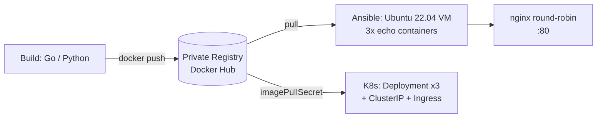

# Cloud.ru DevOps Camp 2025 — решение

> Решение тестового задания Cloud.ru DevOps Camp 2025: путь echo-сервиса от исходника
> до отказоустойчивого деплоя — контейнеризация, Ansible, Kubernetes и *nix-задача
> с изоляцией контейнера изнутри. С разбором принятых решений и граблей.

---

## Краткое содержание

Четыре задачи, охватывающие базовый DevOps-стек: Linux, Docker, Git, Ansible, Kubernetes.
Всё выполнено на хостовой Void Linux; Ubuntu 22.04 поднималась в VirtualBox через Vagrant,
Kubernetes-манифесты применялись на локальном кластере (1 control-plane + 2 worker, v1.31).

**Последовательность:** echo-сервис (Go/Python) → образ в приватном Docker Hub → развёртывание Ansible'ом
(3 контейнера за nginx-балансировщиком) и деплой в Kubernetes (Deployment ×3 + ClusterIP + Ingress)
→ отдельная *nix-задача: заблокировать сеть контейнеру изнутри без правки флагов запуска.

---

## Стек

- **Приложение:** echo-server на Go и на Python (два варианта, слушают :8000)
- **Контейнеризация:** Docker; Go — multi-stage → `scratch`, Python — `python:3.12-alpine`; приватный registry (Docker Hub)
- **Провижининг:** Ansible (Ubuntu 22.04, docker-ce, 3 контейнера, nginx)
- **Балансировка:** nginx, алгоритм round-robin (обоснование ниже)
- **Оркестрация:** Kubernetes — Deployment (3 реплики), ClusterIP, ConfigMap, readiness/liveness, Ingress, imagePullSecrets

---

## Архитектура

---

## Структура репозитория

| Задача | Что внутри | Ссылка |
|--------|-----------|--------|
| 1 | Echo-сервис (Go + Python), Dockerfile'ы, пуш в приватный registry | [`01-application/`](./01-application) |
| 2 | Ansible: docker-ce, 3 контейнера из registry, nginx-балансировщик | [`02-ansible/`](./02-ansible) |
| 3 | K8s-манифесты: Namespace, Secret, ConfigMap, Deployment, Service, Ingress | [`03-kubernetes/`](./03-kubernetes) |
| 4 | *nix: блокировка сети контейнеру изнутри (4 способа) | [`04-unix/`](./04-unix) |

Детали запуска и команды — в README каждой папки.

---

## Разбор по задачам

### Задача 1 — Application `[01]`
Сделаны оба варианта. Ключевой размен — **вес vs удобство и безопасность**: Go на `scratch`
собирается в образ на порядок меньше (единицы МБ против десятков у Python-alpine), и внутри
такого образа нет ни shell, ни пакетного менеджера — закрепиться атакующему негде.
Расплата — отладка «запечатанных часов»: внутрь не зайдёшь. Python проще писать (никакого
multi-stage — рантайм нужен целиком) и удобнее дебажить, но alpine несёт `sh` и сам Python
как готовый инструмент для пост-эксплуатации.

> Для прод-выбора нужен контекст. С прицелом на безопасность — Go-scratch.

### Задача 2 — Ansible `[02]`
Плейбук (без вынесения в роль — для объёма задачи избыточно): установка docker-ce из
официального репозитория, `pip install docker` (иначе модуль `docker_container` падает),
логин в приватный registry, запуск 3 контейнеров и nginx-балансировщик через Jinja-шаблон.

- Контейнеры публикуются на `127.0.0.1:8001..8003` — снаружи недоступны, единственная дверь наружу nginx.
- Токен registry спрятан в `ansible-vault`, не в открытом виде.
- `handlers` перезагружают nginx один раз в конце и только если конфиг реально менялся.

> **Алгоритм балансировки — round-robin.** Приложение stateless, все три контейнера
> идентичны, нагрузка в условии не задана. `least_conn` без известной нагрузки преимуществ
> не даёт, `ip_hash` в этой топологии вреден (весь трафик идёт с localhost и прилип бы к одному контейнеру).

### Задача 3 — Kubernetes `[03]`
Манифесты генерировались через `kubectl ... --dry-run=client -o yaml` и правились руками.

- Отдельный namespace `cloud`.
- Приватный registry → `imagePullSecrets` (иначе вечный `ImagePullBackOff`); секрет создан императивно, чтобы токен не попал в git.
- `AUTHOR` проброшен через `ConfigMap` (`configMapKeyRef`), а не захардкожен.
- `livenessProbe` (перезапуск зависшего) и `readinessProbe` (вывод из эндпоинтов Service до готовности) на `/healthz`.
- `Service` типа `ClusterIP` + опциональный `Ingress`.

### Задача 4 — *nix `[04]`
`iptables` изнутри не работает: контейнер бежит с урезанным набором capabilities, нет
`NET_ADMIN` — а флаги запуска и демон трогать нельзя. Значит блокируем не сам L3, а
**разрешение имён** — этого достаточно, чтобы положить `apt`. Четыре способа:

1. `/etc/nsswitch.conf` — убрать `dns` из строки `hosts:` (NSS glibc перестаёт ходить в DNS).
2. `/etc/resolv.conf` — обнулить (`> /etc/resolv.conf`), не остаётся nameserver'ов.
3. `/etc/hosts` — увести адреса зеркал Ubuntu в тупик.
4. APT-прокси на `127.0.0.1:9` (discard, RFC 863) — только для apt, точечно.

> По IP наружу трафик при этом всё ещё идёт — полностью изолировать сеть изнутри без `NET_ADMIN` нельзя, и в этом соль задачи со звёздочкой.

---

## Ошибки и грабли

- **`Not supported URL scheme http+docker`** при запуске плейбука — устаревшая коллекция
  `community.docker` в связке с новым `requests`. Лечится `ansible-galaxy collection install community.docker --upgrade`.
- **`iptables ... Permission denied (you must be root)`** изнутри контейнера — не про uid,
  а про отсутствие capability `NET_ADMIN`. Именно это развернуло решение задачи 4 в сторону саботажа DNS.
- **Bind-mount файлов Docker'ом** (`/etc/resolv.conf`, `/etc/hosts`, `/etc/hostname`) — их
  правит запись на месте (`>`, `cat >>`, nano), а vim через rename-временного-файла может не сохранить.

---

## Выводы (Lessons Learned)

- Выбор языка/базового образа — это осознанный размен «вес и attack surface» против «удобство отладки», а не вкусовщина.
- Значимая часть «магии» Ansible — идемпотентность и `handlers`; плейбук это не шелл-скрипт по списку.
- Многие K8s-манифесты быстрее родить через `--dry-run=client -o yaml`, чем писать с нуля.
- Без нужной capability сетевую задачу решают не на сетевом уровне, а там, где привилегий хватает — на уровне резолвинга имён.

---

## Как запустить

Prerequisites и пошаговые команды — в README соответствующих папок
([`01`](./01-application) · [`02`](./02-ansible) · [`03`](./03-kubernetes) · [`04`](./04-unix)).

---

Author: <a href="https://github.com/alfabuster">@alfabuster</a>
